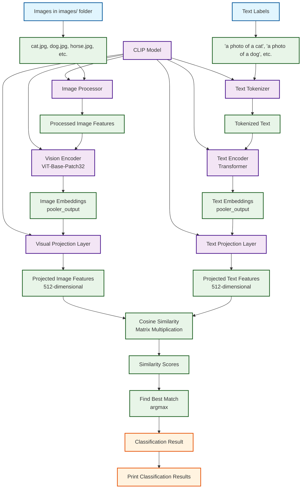
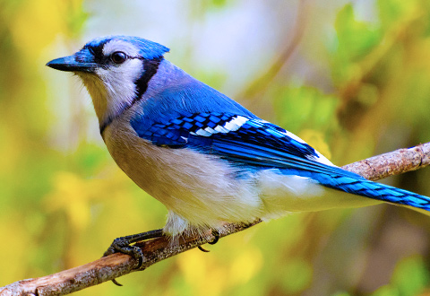

# CLIP Image Classifier

This project uses OpenAI's CLIP model to classify images based on a set of textual prompts.

## How it works

- For each image in the `images/` folder, the script compares it to a list of classifier texts (e.g., "a photo of a cat", "a photo of a dog", etc.).
- The script prints the best-matching label for each image, along with a similarity score.

## Architecture Diagram



## Sample Images

The classifier works with various types of images. Here are some examples from the dataset:

- cat: best match is 'a photo of a cat' (score: 30.380)
- dog: best match is 'a photo of a dog' (score: 35.998)
- horse: best match is 'a photo of a horse' (score: 36.964)
- bird: best match is 'a photo of a bird' (score: 30.397)
- car: best match is 'a photo of a car' (score: 23.982)
- person: best match is 'a photo of a person' (score: 27.901)
- tree: best match is 'a photo of a tree' (score: 30.656)
- house: best match is 'a photo of a house' (score: 29.412)
- book: best match is 'a photo of a book' (score: 40.067)
- phone: best match is 'a photo of a phone' (score: 32.127)

<div align="center">

   

   

 

</div>

## Setup

1. **Install dependencies:**
   ```bash
   pip install -r requirements.txt
   ```

2. **Prepare your images:**
   - Place your images in the `images/` folder.

3. **Run the script:**
   ```bash
   python clip.py
   ```

## Files

- `clip.py` — Main script for running the classifier.
- `requirements.txt` — Python dependencies.
- `images/` — Folder containing your images.

---

*Feel free to modify or extend this project!*